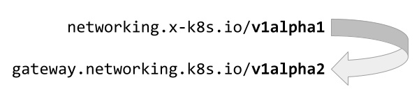
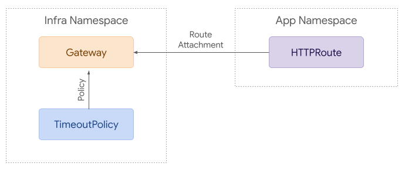

# Gateway API v1alpha2 소개

<small style="position:relative; top:-30px;">
  :octicons-calendar-24: October 14, 2021 ·
  :octicons-clock-24: 5 min read
</small>

두 번째 알파 API 버전인 v1alpha2의 릴리스를 발표하게 되어 기쁘다.
이 릴리스에는 몇 가지 주요 변경 사항과 개선 사항이 포함되어 있다. 이 글에서
주요 내용을 다룬다.

## 주요 내용

### 새로운 API 그룹
공식 Kubernetes API로서의 위상에 맞게, 실험적 API 그룹(`networking.x-k8s.io`)에서
새로운 `gateway.networking.k8s.io` API 그룹으로 전환했다. 이는 apiserver 관점에서
이 버전이 v1alpha1과 완전히 다른 것이며, 자동 변환이 불가능하다는 것을 의미한다.



### 더 간단한 라우트-게이트웨이 바인딩
v1alpha1에서는 **게이트웨이(Gateway)**와 **라우트(Route)**를 연결하는 여러 가지 방법을 제공했다. 이는
이해하기가 다소 복잡했다. v1alpha2에서는 더 간단한 연결 메커니즘에 집중했다:

* 라우트는 연결하려는 게이트웨이를 직접 참조한다. 이것은
  리스트이므로 하나의 라우트가 둘 이상의 게이트웨이에 연결할 수 있다.
* 각 게이트웨이 **리스너(Listener)**는 지원하는 라우트의 종류와
  위치를 지정할 수 있다. 기본값은 게이트웨이와 같은 **네임스페이스(Namespace)**에 있는
  지정된 프로토콜을 지원하는 라우트이다.

예를 들어, 다음 HTTPRoute는 `parentRefs` 필드를 사용하여
`prod-web-gw` 게이트웨이에 자신을 연결한다.

```yaml
apiVersion: gateway.networking.k8s.io/v1alpha2
kind: HTTPRoute
metadata:
  name: foo
spec:
  parentRefs:
  - name: prod-web
  rules:
  - backendRefs:
    - name: foo-svc
      port: 8080
```

이에 대한 자세한 내용은 [GEP 724](../../geps/gep-709/index.md)에서 다룬다.

### 안전한 교차 네임스페이스 참조

!!! info "Experimental Channel"

    아래에서 설명하는 `ReferenceGrant` 리소스는 현재 Gateway API의
    "Experimental" 채널에만 포함되어 있다. 릴리스 채널에 대한
    자세한 내용은 [버전 관리 가이드](../../concepts/versioning.md)를 참조한다.

안전한 방식으로 네임스페이스 경계를 넘는 것은 상당히 어려운 일이다. Gateway API에서는
이 기능이 필요한 몇 가지 핵심 기능 요청이 있었다.
가장 대표적으로, 다른 네임스페이스의 **백엔드(Backend)**로 **트래픽(Traffic)**을 전달하는 것과 다른
네임스페이스의 TLS 인증서를 참조하는 것이 있다.

이를 위해 핸드셰이크 메커니즘을 제공하는 새로운 **ReferenceGrant(레퍼런스 그랜트)** 리소스를
도입했다. 기본적으로 네임스페이스 간 참조는 허용되지 않으며,
네임스페이스 간 참조(예: 다른 네임스페이스의 Service를 참조하는 라우트)를
생성하는 것은 구현체에 의해 거부되어야 한다. 이러한
참조는 참조 대상(타겟) 네임스페이스에 ReferenceGrant를 생성하여 수락할 수 있으며,
어떤 Kind가 들어오는 참조를 수락할 수 있는지, 그리고 어떤 네임스페이스와 Kind에서
참조가 올 수 있는지를 지정한다.

예를 들어, 다음 ReferenceGrant는 prod 네임스페이스의 HTTPRoute가 이 ReferenceGrant가
설치된 곳의 Service로 트래픽을 전달하는 것을 허용한다:

```yaml
apiVersion: gateway.networking.k8s.io/v1alpha2
kind: ReferenceGrant
metadata:
  name: allow-prod-traffic
spec:
  from:
  - group: gateway.networking.k8s.io
    kind: HTTPRoute
    namespace: prod
  to:
  - group: ""
    kind: Service
```

이에 대한 자세한 내용은 [GEP 709](../../geps/gep-709/index.md)에서 다룬다.

### 정책 연결
이 API의 핵심 목표 중 하나는 의미 있고 일관된 확장 포인트를 제공하는 것이다.
v1alpha2에서는 Gateway API 리소스에 **정책(Policy)**을 연결하는 새로운 표준을 도입했다.

정책이란 무엇인가? 이는 구현체에 따라 다르지만, 시작하기에 가장 좋은
예시는 타임아웃 정책이다.

HTTP 연결에 대한 타임아웃 정책은 기본 구현체가 정책을 처리하는 방식에 크게
의존하며, 공통점을 추출하기가 매우 어렵다.

이것은 다음과 같은 것들을 허용하기 위한 것이다:

* **GatewayClass(게이트웨이 클래스)**에 백엔드의 기본 연결 타임아웃을 지정하는 정책을 연결한다.
  해당 클래스에 속하는 모든 게이트웨이의 라우트는 별도로 지정하지 않는 한
  해당 기본 연결 타임아웃을 적용받는다.
* GatewayClass의 멤버인 게이트웨이에 다른 기본값이 연결되어 있다면,
  그것이 GatewayClass보다 우선한다(기본값의 경우, 더 구체적인
  객체가 덜 구체적인 객체보다 우선한다).
* 또는, 클라이언트 타임아웃을 "타임아웃 없음"으로 설정할 수 없도록 하는 정책을
  오버라이드로 GatewayClass에 연결할 수 있다. 오버라이드는
  항상 적용되며, 덜 구체적인 것이 더 구체적인 것보다 우선한다.

간단한 예시로, TimeoutPolicy를 게이트웨이에 연결할 수 있다. 해당
정책의 효과는 그 정책에 연결된 라우트로 하위 전파된다:



이에 대한 자세한 내용은 [GEP 713](../../geps/gep-713/index.md)에서 다룬다.

## 다음 단계
v1alpha2에는 여기에서 다루지 못한 많은 변경 사항이 있다. 전체 변경 내역은
[v0.4.0 릴리스
노트](https://github.com/kubernetes-sigs/gateway-api/releases/tag/v0.4.0)를 참조한다.

많은 [구현체](../../implementations.md)가 앞으로 몇 주 내에 v1alpha2 API에 대한 지원을
릴리스할 계획이다. v1alpha2 구현체가 사용 가능해지면 문서를 업데이트할 것이다.

아직 해야 할 작업이 많이 남아 있다. 다음에 논의할 주요 항목들은 다음과 같다:

* 적합성 테스트
* 라우트 위임
* 재작성 지원
* L4 라우트 매칭

이러한 주제에 관심이 있다면, 여러분의 의견을 듣고 싶다. 참여 방법은
[커뮤니티 페이지](../../contributing/index.md)를 참조한다.
