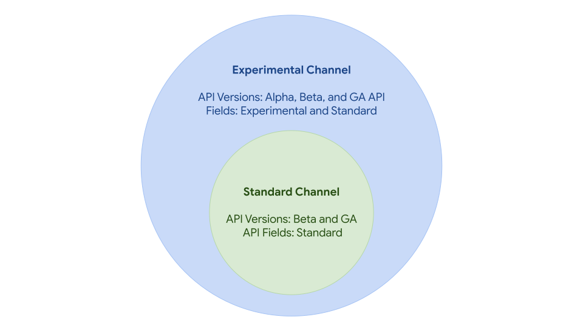

# 버전 관리

## 개요
게이트웨이 API의 각 새로운 릴리스는 v1.0.0과 같은 릴리스의 Git 태그를 나타내는
"번들 버전"으로 정의한다.
이 번들은 다음을 포함한다.

* API 타입(리소스에 대한 Go 바인딩)
* CRD(리소스에 대한 쿠버네티스 정의)

### 릴리스 채널
릴리스 채널은 게이트웨이 API 내에서 기능의 안정성을 나타내는 데 사용된다.
모든 새로운 기능과 리소스는 실험적 릴리스 채널에서 시작된다.
그 후,
이들은 표준 릴리스 채널로 승격되거나 API에서 완전히 제거될 수 있다.

아래 다이어그램은 게이트웨이 API에서 새로운
[GEP](../geps/overview.md)(기능 향상 제안서)로 제안된 기능이나
리소스의 라이프사이클에 대한 높은 수준의 개요를 제공한다.

```mermaid
flowchart TD
    0([Implementable GEP]) --> A
    A>Experimental Channel] --> B([Widely used and working well?])
    B -->|Yes| C>Standard Channel]
    B -->|No| D([Could Changes Help?])
    D -->|Yes| E([Adjust and try again])
    D -->|No| F>Remove From API]
    E -->A

style A fill:#eeb
style C fill:#beb
style F fill:#ebb
```

표준 릴리스 채널에는 다음이 포함된다.

* beta 또는 GA API 버전으로 승격된 리소스(beta API 버전은 게이트웨이 API에서 점진적으로 제거되고 있다는 점에
  유의해야 한다.)
* 실험적 채널에서 표준 채널로 승격된 모든 필드

실험적 릴리스 채널에는 표준 채널에 포함된 모든 항목에 추가로 다음을
포함한다.

* alpha API 버전의 리소스
* 표준 채널로 승격되기 전의 모든 신규 필드


<!-- Source: https://docs.google.com/presentation/d/1sfZTV-vlisDUIie_iK_B2HqKia_querT6m6T2_vbAk0/edit -->

기본적으로 안정적인 사용 경험을 제공하므로 표준 채너을 사용하는 것을 권장한다.
많은 구현체드이 실험적 채널도 지원하며, 이를 통해 새로운 기능을 빠르게 반복 개발할 수 있다.
이 채널은 이전 버전과의 호환성에 대한 보장을 제공하지 않으며,
언제든지 호환되지 않는 변경 사항이
릴리스될 수 있다는 점에 유의해야 한다.

### API 버전
업스트림 쿠버네티스 API는 안정성 수준을 alpha, beta, GA API 버전의 세 가지로 구분한다.
게이트웨이 API에서는 위에서 설명한 릴리스 채널을 통해
이를 두 가지 안정성 수준으로 축소하였다.

일반적으로, 리소스가 실험적 채널에서 표준 채널로 승격될 때,
Alpha API 버전(v1alpha2)에서 GA API 버전(v1)으로도
승격된다는 것을 의미한다.

#### 근거
아래와 같은 이유로 beta는 점진적으로 제거되고 있다.

1. 대부분의 경우 API 안정성 수준은 실질적으로 두 가지이다.
   - 기본적(stable)으로 설치되는 상태와 alpha/experimental(unstable) 상태
   게이트웨이 API에서는 중간 단계 (Beta 상태)의 가치가 명확하지 않다.
2. "안정(stable)"과 "실험적(experimental)" API를 더 멀리 분리할수록,
   새로운 기능에 대한 의미 있는 피드백을 얻는 데 더 오래 걸린다.
3. 우리가 관리하는 각 고유 API 버전은
   사용자, 구현자, 유지관리자 모두에게 상당한 추가 비용을 발생시킨다.

#### 베타
일부 게이트웨이 API 리소스는 표준 채널로 승격될 때 Beta API 버전을 받은 경우가 있지만,
앞으로 추가되는 리소스에는 해당되지 않는다.
앞으로 표준 채널로 승격되는 모든 리소스는
그 과정의 일부로 v1 API 버전을 포함하게 된다.

이미 beta API 버전(v1beta1)을 가진 리소스는 다음과 같다.

* HTTPRoute
* 게이트웨이(Gateway)
* 게이트웨이 클래스(GatewayClass)
* 레퍼런스그랜트(ReferenceGrant)

v1.0 릴리스에서 HTTPRoute, 게이트웨이, 게이트웨이 클래스는 모두 GA API 버전(v1)으로
승격되었다.

레퍼런스그랜트는 예외적이다.
이 리소스는
현재 [상위 쿠버네티스 API로 전환](https://github.com/kubernetes/enhancements/issues/3766) 중이며,
[sig-auth](https://github.com/kubernetes/community/blob/master/sig-auth/README.md)에서
관리한다.
이 과정이 완료될 때까지 레퍼런스그랜트는 게이트웨이 API에서 사실상 베타로 동결될 가능성이 높다.
레퍼런스그랜트가 내장 쿠버네티스 API로 널리 제공되면,
게이트웨이 API의 표준 채널에서 제거할 예정이다.

## 버전 표시
각 CRD는 번들 버전과 채널을 나타내는 어노테이션과 함께
배포된다.

```
gateway.networking.k8s.io/bundle-version: v0.4.0
gateway.networking.k8s.io/channel: standard|experimental
```

## 변경 가능한 것
이 API를 사용하거나 구현할 때,
번들 버전 간에 무엇이 변경될 수 있는지 이해하는 것이 중요하다.

### 패치 버전(예: v0.4.0 -> v0.4.1)
* API 명세:
    * 명확성 개선
    * 오타 수정
* 버그 수정:
    * 유효성 검사 수정
    * 릴리스 프로세스 또는 산출물 수정
* 적합성 테스트:
    * 기존 테스트 수정
    * 기존 기능에 대한 적합성 테스트 커버리지 추가

### 마이너 버전(예: v0.4.0 -> v0.5.0)
* 패치 릴리스에서 유효한 모든 변경
* 실험적 채널:
    * 새로운 API 필드 또는 리소스 추가
    * 기존 API 필드 또는 리소스에 대한 중대 변경
    * 사전 사용 중단(deprecation) 없이 API 필드 또는 리소스 제거
* 표준 채널:
    * 실험적에서 표준 채널로의 필드 또는 리소스 승격
    * [쿠버네티스 사용 중단 정책](https://kubernetes.io/docs/reference/using-api/deprecation-policy/)에 따라
      API 리소스 제거
* 모든 채널:
    * 상태에서 권장 조건 또는 사유 변경
    * 유효성 검사 완화(필수 필드를 선택적 필드로 변경 등)
    * 명세 업데이트에 맞춘 적합성 테스트 변경
    * 필드명 변경이나
      [새로운 쿠버네티스 API 버전](https://kubernetes.io/ko/docs/reference/using-api/#api-%EB%B2%84%EC%A0%84-%EA%B7%9C%EC%B9%99)에서 
      유효한 기타 모든 변경 사항을 포함할 수 있는 새로운 API 버전의 도입

### 메이저 버전(예: v0.x -> v1.0)
* 메이저 버전이 변경될 때는 API 호환성 보장을 하지 않는다.

## 승격 기준
리소스, 필드, 기능이 실험적에서 표준으로 승격되기 위해서는
다음 기준을 충족해야 한다.

* 완전한 적합성 테스트 커버리지
* 여러 구현체에서 적합성 통과
* 광범위한 구현 및 사용
* alpha API로 최소 6개월간 운영된 시간(soak time)
* 최소 1회 마이너 릴리스 및 3개월간 주요 변경 없음
* 서브프로젝트 오너 및 KEP 리뷰어 승인

## 지원 버전
이 프로젝트는 다양한 쿠버네티스 버전에서 일관된 업그레이드 경험을 지원하는 것을 목표로 한다.
이를 달성하기 위해 다음과 같은 사항을 준수한다.

1. 가장 최근 쿠버네티스 마이너 버전 5개 이상을 최소 지원 대상으로 한다.
2. v1beta1과 v1 사이의 표준 채널 변경은 모두 완전히
   호환 및 변환 가능하도록 보장한다.
3. 변환(conversion) 웹훅 도입은 최대한 피하도록 노력한다.
   만약 변환 웹훅이 도입되어야 할 경우,
   해당 API의 라이프타임 동안 또는 최소한 대안이 제공될 때까지 지원한다.

## CRD 관리
클러스터에서 게이트웨이 API CRD를 관리하는 방법은 [CRD 관리 가이드](../guides/crd-management.md)를
참고하자.

## 범위 외 항목
### 미출시 API
이 프로젝트는 main 브랜치에 자주 업데이트가 발생한다.
main을 포함한 어떤 브랜치의 코드에도 릴리스되기 전까지는 호환성 보장이 없다.
예를 들어, 릴리스가 공개되기 전에 변경이 되돌려질 수 있다.
최상의 결과를 위해서는 이 프로젝트의 최신 공개 릴리스를
사용하는 것이 좋다.

### 소스 코드
소스 코드 import에 대한 안정성은 보장하지 않는다.
인터페이스와 동작은 향후 릴리스에서 예기치 않게,
그리고 이전 버전과 호환되지 않는 방식으로 변경될 수 있다.
