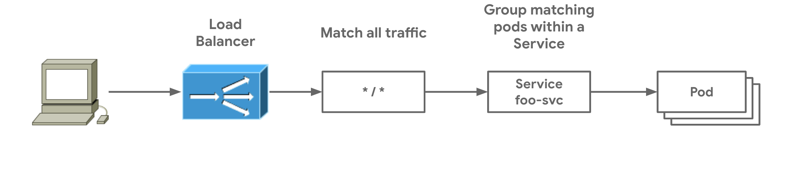

# 간단한 게이트웨이 배포하기

이 가이드는 Gateway API를 처음 사용하는 경우 시작하기에 좋은 곳입니다. 가장 간단한 배포를 보여줍니다: 같은 소유자가 함께 배포하는 Gateway와 Route 리소스. 이는 Ingress에 사용되는 것과 유사한 모델을 나타냅니다. 이 가이드에서는 모든 HTTP 트래픽을 매칭하여 `foo-svc`라는 단일 서비스로 보내는 Gateway와 HTTPRoute를 배포합니다.



```yaml

```

Gateway(게이트웨이)는 논리적 로드 밸런서의 인스턴스화를 나타내며,
GatewayClass(게이트웨이 클래스)는 사용자가 게이트웨이를 생성할 때
로드 밸런서 템플릿을 정의합니다. 예제 게이트웨이는 가상의 `example`
게이트웨이 클래스에서 템플릿화되며, 이는 자리 표시자로서
사용자가 대체해야 합니다. 특정 인프라 제공자에 따라 올바른
게이트웨이 클래스를 결정하는 데 사용할 수 있는
[게이트웨이 구현체](../../implementations.md)
목록을 확인하세요.

게이트웨이는 포트 80에서 HTTP 트래픽을 수신 대기합니다. 이 특정
게이트웨이 클래스는 IP 주소를 자동으로 할당하며, 이는 배포 후
`Gateway.status`에 표시됩니다.

Route 리소스는 `ParentRefs`를 사용하여 연결하려는 게이트웨이를 지정합니다.
게이트웨이가 이 연결을 허용하는 한 (기본적으로 같은 네임스페이스의
Route는 신뢰됨), Route는 부모 게이트웨이로부터 트래픽을 수신할 수 있습니다.
`BackendRefs`는 트래픽이 전송될 백엔드를 정의합니다. 더 복잡한 양방향
매칭 및 권한은 다른 가이드에서 설명합니다.

다음 HTTPRoute는 게이트웨이 리스너의 트래픽이 백엔드로 라우팅되는
방법을 정의합니다. 호스트 라우트나 경로가 지정되지 않았으므로,
이 HTTPRoute는 로드 밸런서의 포트 80에 도착하는 모든 HTTP 트래픽을
매칭하여 `foo-svc` 파드로 전송합니다.

```yaml

```

Route 리소스는 종종 다양한 백엔드(잠재적으로 다른 소유자를 가진)로
트래픽을 필터링하는 데 사용되지만, 이 예제는 단일 서비스 백엔드를 가진
가장 간단한 라우트를 보여줍니다. 이 예제는 서비스 소유자가 자신만의
사용을 위해 게이트웨이와 HTTPRoute를 모두 배포하여 서비스가 노출되는
방식에 대해 더 많은 제어와 자율성을 가질 수 있는 방법을 보여줍니다.
